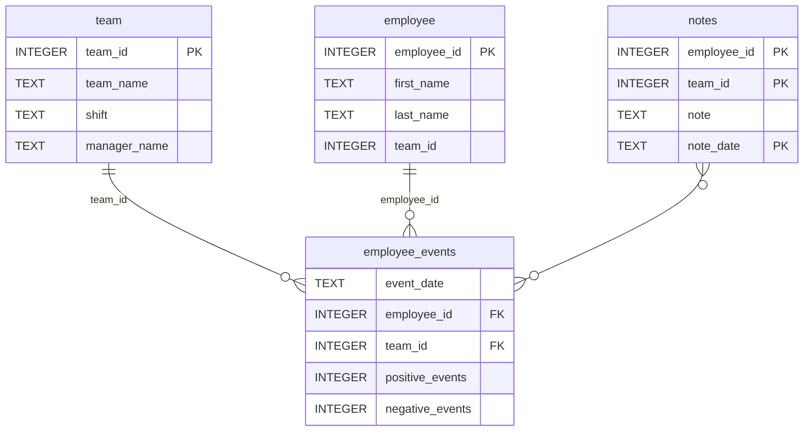

# Software Engineering for Data Scientists Project

This repository contains code for the **Software Engineering for Data Scientists** final project. This project creates an interactive dashboard to help managers monitor employee and team performance performance and also assess the risk of  employees recruitment.

## Table of Contents
* [General Info](#general-information)
* [Technologies Used](#technologies-used)
* [Setup and Installation](#setup)
* [Usage](#usage)
* [Project Status](#project-status)
* [Room for Improvement](#room-for-improvement)
* [Acknowledgements](#acknowledgements)
* [File Information](#files)


## General Information <a name="general-information"></a>
The motivation for this project was to build a dashboard that allows managers to monitor an employee's performance and their predicted risk of recruitment.
    * The dashboard visualizes the productivity of a single employee or a team of employees
    * The dashboard displays an employee's likelihood of recruitment, or a team of employees' average likelihood of recruitment

## Technologies Used <a name="technologies-used"></a>
    * Python 3.12.10

## Setup and Installation <a name="setup"></a>

#### * Clone the git repo 
        * git clone https://github.com/rachel5678b/dsnd-dashboard-project.git

#### * Create and Activate a Python Virtual Environment (Recommended)   
        * create: **python -m venv p2_venv**
        * activate: **source p2_venv/bin/activate** or on Windows **p2_venv\Scripts\activate**
  
#### * Install Dependencies
        * A full list of package dependencies can be found in the included requirements.txt file, to install these dependencies, use the command below.
            * **pip install -r requirements.txt**

## Usage <a name="usage"></a>
    * To run the dashboard, use the command: **python report/dashboard.py**
      * Under the employee dashboard, select the the employee name form the dropdown to view data about that employee.
      * Under the team dashboard, select the team name form the dropdown to view data about that team.
    
## Project Status <a name ="project-status"></a>
This project is complete at this time


## Room for Improvement<a name ="room-for-improvement"></a>
Future improvements could include:
  * Display employee team name 
  * Display employee ID
  * Display team roster


## Licensing, Authors, and Acknowledgements<a name="acknowledgements"></a>

This project was created with guidance from Udacity Data Scientist course

For more information on licensing, see the included LICENSE.txt


## File Description<a name="files"></a>

The included files are structured as noted below.

### Repository Structure
```
├── README.md
├── assets
│   ├── model.pkl
│   └── report.css
├── env
├── python-package
│   ├── employee_events
│   │   ├── __init__.py
│   │   ├── employee.py
│   │   ├── employee_events.db
│   │   ├── query_base.py
│   │   ├── sql_execution.py
│   │   └── team.py
│   ├── requirements.txt
│   ├── setup.py
├── report
│   ├── base_components
│   │   ├── __init__.py
│   │   ├── base_component.py
│   │   ├── data_table.py
│   │   ├── dropdown.py
│   │   ├── matplotlib_viz.py
│   │   └── radio.py
│   ├── combined_components
│   │   ├── __init__.py
│   │   ├── combined_component.py
│   │   └── form_group.py
│   ├── dashboard.py
│   └── utils.py
├── requirements.txt
├── start
├── tests
    └── test_employee_events.py
```


### employee_events.db <a name="employee_events"></a>



